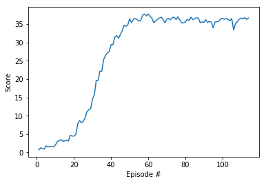

# Continuous Control with Deep Deterministic Policy Gradient
## Deep Deterministic Policy Gradient

### 1. Learning Algorithm

  - DDPG<sup>1</sup> is a different kind of actor-critic method. It could be seen as an approximate DQN instead of an actual actor-critic. This is because the critic in DDPG is used to approximate the maximizer over the Q values of the next state and not as a learned baseline.
  - One of the DQN agent's limitations is that it is not straightforward to use in continuous action spaces. Imagine a DQN network that takes the state and outputs the action-value function. For example, for two actions, say, up and down, ```Q(S, "up")``` gives you the estimated expected value for selecting the up action in state ```S```, say ```-2.18```. ```Q(S,  "down")``` gives you the estimated expected value for choosing the down action in state ```S```, say ```8.45```. To find the max action-value function for this state, you just calculate the maximum of these values. Pretty easy. It's straightforward to do a ```max``` operation in this example because this is a discrete action space. Even if you had more actions say a left, a right, a jump, and so on, you still have a discrete action space. Even if it were high dimensional with many, many more actions, it would still be feasible. But how do you get the value of continuous action with this architecture? Say you want the jump action to be continuous, a variable between ```1``` and ```100``` centimeters. How do you find the value of jump, say ```50``` centimeters? This is one of the problems DDPG solves.
  - In DDPG, we use two deep neural networks: the actor and the critic.
    - The actor here is used to approximate the optimal policy deterministically. That means we want to always output the best-believed action for any given state. This is unlike stochastic policies in which we want the policy to learn a probability distribution over the actions. In DDPG, we want the believed the best action every single time we query the actor network. That is a deterministic policy. The actor is learning the ```argmax Q(S, a)```, which is the best action.
    - The critic learns to evaluate the optimal action-value function by using the actor's best-believed action. Again, we use this actor, an approximate maximizer, to calculate a new target value for training the action-value function, much like DQN does.

### 2. Model Architecture for the Neural Network
  - #### Actor Network
    |Layer        | Input/Output Sizes | Activation Function |
    | ----------- | -----------        | -----------         |
    | Linear      | (33, 128)          | Relu                |
    | Linear      | (128, 128)         | Relu                |
    | Linear      | (128, 4)           | Tanh                |

  - #### Critic Network
    |Layer        | Input/Output Sizes | Activation Function |
    | ----------- | -----------        | -----------         |
    | Linear      | (33, 128)          | Relu                |
    | Linear      | (132, 128)         | Relu                |
    | Linear      | (128, 1)           |                     |

  - #### Experience Replay
    - I created a ReplayBuffer Class to enable experience replay<sup>2, 3</sup>. Using the replay pool, the behavior distribution is averaged over many of its previous states, smoothing out learning and avoiding oscillations. The advantage is that each step of the experience is potentially used in many weight updates.
  - #### Soft Updates to The Target Networks
    - In DQN, there are two copies of the network weights, the regular and the target network. In the Atari paper<sup>4</sup> in which DQN was introduced, the target network is updated every 10,000 time steps. We can simply copy the weights of the regular network into the target network. The target network is fixed for 10,000 time steps, and then gets a big update.
    - In DDPG, there are two copies of the network weights for each network: a regular for the actor, a regular for the critic, a target for the actor, and a target for the critic. The target networks are updated using a soft updates strategy. A soft update strategy consists of slowly blending your regular network weights with the target network weights. So, every time step, I make the target network be 99.99 percent of the target network weights and only 0.01 percent of the regular network weights. I slowly mix in the regular network weights into the target network weights. The regular network is the most up-to-date network, while the target network is the one we use for prediction to stabilize training. We get faster convergence by using this update strategy. Soft updates can be used with other algorithms that use target networks, including DQN.

### 3. Hyperparameters
  - #### Replay buffer size
    - BUFFER_SIZE = int(1e5)
  - #### Minibatch size
    - BATCH_SIZE = 128
  - #### Discount factor
    - GAMMA = 0.99
  - #### For soft update of target parameters
    - TAU = 1e-3
  - #### Learning rate
    - LR = 5e-4
  - #### learning rate of the actor
    - LR_ACTOR = 1e-3
  - #### learning rate of the critic
    - LR_CRITIC = 1e-3
  - #### L2 weight decay
    - WEIGHT_DECAY = 0

## Plot of Rewards
The environment was solved in 102 episodes.



## Ideas for Future Work

- Prioritized Experience Replay: I have adopted experience replay in the DDPG. But some of these experiences may be more important for learning than others. Moreover, these important experiences might occur infrequently. If we sample the batches uniformly, then these experiences have a very small chance of getting selected. Since buffers are practically limited in capacity, older important experiences may get lost. I will implement prioritized experience replay<sup>5</sup> will help to optimize the selection of experiences.

References:

1. Lillicrap, Hunt, et al. "Continuous control with deep reinforcement learning." 2015. https://arxiv.org/abs/1509.02971

2. Riedmiller, Martin. "Neural fitted Q iteration–first experiences with a data efficient neural reinforcement learning method." European Conference on Machine Learning. Springer, Berlin, Heidelberg, 2005. http://ml.informatik.uni-freiburg.de/former/_media/publications/rieecml05.pdf

3. Mnih, Volodymyr, et al. "Human-level control through deep reinforcement learning." Nature518.7540 (2015): 529. http://www.davidqiu.com:8888/research/nature14236.pdf

4. Mnih,  Kavukcuoglu, et al. "Playing Atari with Deep Reinforcement Learning." https://www.cs.toronto.edu/~vmnih/docs/dqn.pdf

5. Schaul, Quan, et al. "Prioritized Experience Replay." ICLR (2016). https://arxiv.org/abs/1511.05952


